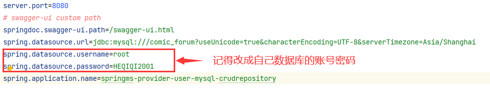
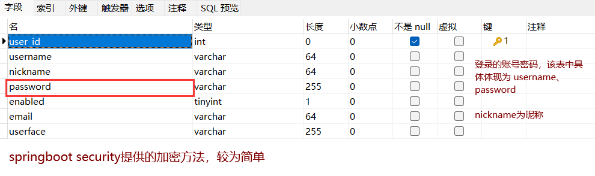
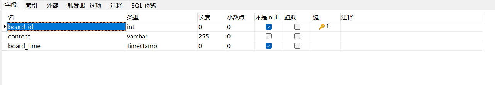
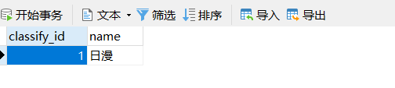
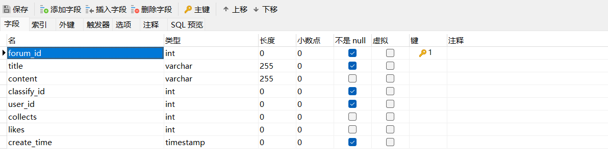
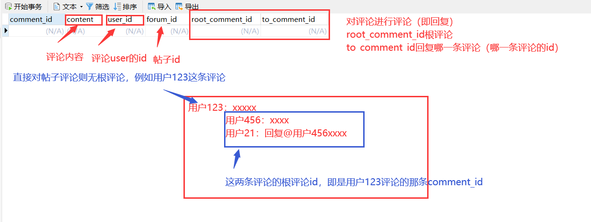
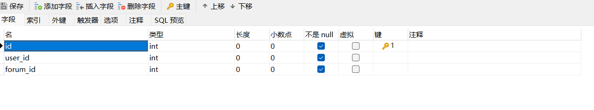
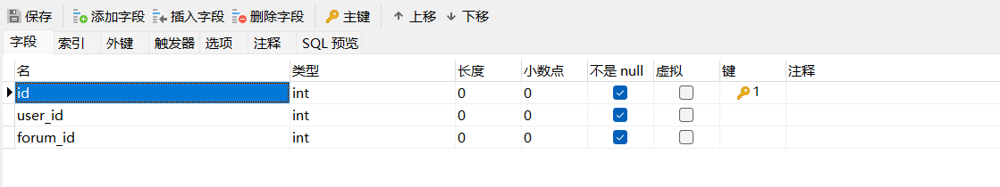

# animation-forum-system

#### 介绍
动漫论坛系统

#### 软件架构
 _springboot+react前后端分离_ 

 **数据库记得改成自己的账号密码** 

#### 目前的数据库设计

 _数据库总体设计已完成_ 

数据库使用MySQL8.0

几个表如下：

 **user表的设计** 

 **board表的设计** 

 **classify表的设计** 

 **forum表的设计** 

 **comment表的设计** 

 **collects表和likes表的设计** 

