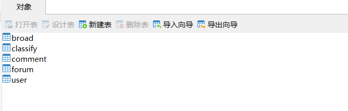
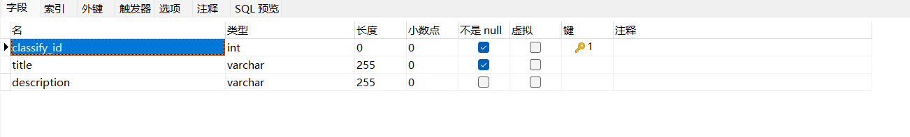

# animation-forum-system

#### 介绍
动漫论坛系统

#### 软件架构
springboot+react前后端分离

 **数据库记得改成自己的账号密码** 

#### 目前的数据库设计
暂时设计的几张表:

评论表-comment

其中评论的数据库设计的 **root_comment_id** 和 **to_comment_id** 构造类似B站的评论区

板块表-classify
该表仅包括板块分类

帖子表-forum

该表包括帖子id、标题、内容、板块分类编号、收藏数、点赞数

用户表-user

**该表暂未进行数据库加密，最后来做。** 
